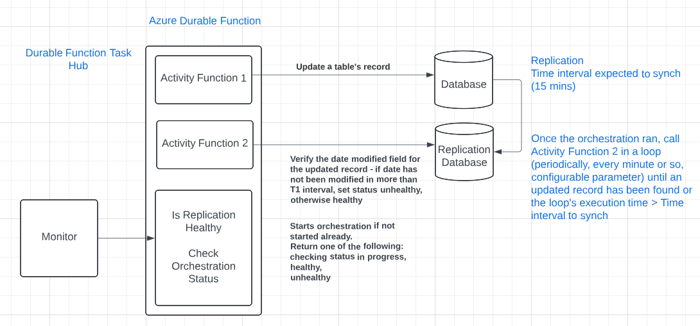

# SQL Server Replication Alerts and Health Check using Azure Durable Functions 

## Project's description

This article details implementing a **SQL Server replication's health check using Azure Durable functions**.

## Online article
Details about this project can be read in my blog's article here: 
[Article](https://www.linkedin.com/pulse/sql-server-replication-alerts-health-check-using-azure-eugen-frunza-6srec/?trackingId=yvv5zVVdSsClwRosnmvtPg%3D%3D))

## Context
I have done this work in 2023. The main technologies used were: **.NET Core**, **Azure Durable Functions**, and **Azure**.
